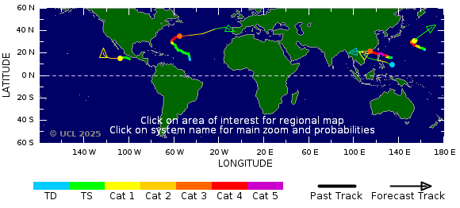

# Super Typhoon RAGASA
Storm Alert issued at 21 Sep, 2025 6:00 GMT

# 2025-09-25

# 2025-09-24

24 Sep, 2025 6:00 GMT  
Typhoon RAGASA is currently located near 21.6 N 112.6 E with maximum 1-min sustained winds of 105 kts (121 mph). RAGASA is a category 3 storm   

# Satellite Image
## Hamawari Day Image, 09:10 UTC

## Heavy Rainfall Potential  

winds of 115 kts (132 mph). RAGASA is a category 4 storm.
## Storm Track Globe
There are 5 active systems as of 24 Sep, 2:14 GMT

# 2025-09-23
Windspeed: 220 kph, category-8. The most powerful typhoon. Evacuation in Philippines, Hongkong.
## Storm Track Forecast Zoom-1

## Storm Track Forecast Zoom-2

## Storm Track Forecast Zoom-3

# Satellite Image
## Hamawari Day Image, 16:30 UTC

## Hamawari Night View Image, 16:30 UTC

## Heavy Rainfall Potential

# Radar Image

# Formation: 19 Sep, 2025 18:00 GMT
Tropical Storm RAGASA is currently located near 16.2 N 130.0 E with maximum 1-min sustained winds of 55kts (63 mph)

# References
- https://www.tropicalstormrisk.com/
- https://www.data.jma.go.jp/mscweb/data/himawari/
