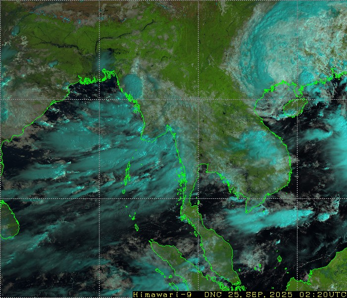

# Super Typhoon RAGASA
Storm Alert issued at 21 Sep, 2025 6:00 GMT

# 2025-09-25
There are 6 active systems as of 25 Sep, 2:24 GMT  

## Storm Tracks
### Storm Tracks Globe View

## Typhoon RAGASA  
RAGASA is a category 1 storm   25 Sep, 12:00 UTC 21.8 N	111.1 E	80 kts  
### Storm Track Forecast Zoom-2

## Satellite Image 25 Sep 2025 15:20 UTC
### Himawari Infrared Night-Time Image: 25 Sep 2025 15:20 UTC  

### Himawari Infrared Night-Time Microphysics RGB Image: 25 Sep 2025 15:20 UTC  

### Hamawari Heavy Rainfall Potential 25 Sep 2025  15:20 UTC  

## Typhoon RAGASA
RAGASA is a category 3 storm   25 Sep, 0:00	UTC

### Storm Track Forecast Zoom-2

## Satellite Image
### Himawari Real-Time Image: 25 Sep 2025 02:20 UTC  

### Himawari Day Convective Storm RGB: 25 Sep 2025 02:20 UTC  

### Himawari Day Time Microphysics RGB: 25 Sep 2025 02:20 UTC  

### Hamawari Heavy Rainfall Potential 25 Sep 2025 02:20 UTC  

# 2025-09-24

24 Sep, 2025 6:00 GMT  
Typhoon RAGASA is currently located near 21.6 N 112.6 E with maximum 1-min sustained winds of 105 kts (121 mph). RAGASA is a category 3 storm   

## Satellite Image
### Hamawari Day Image, 09:10 UTC

### Hamawari Day RGB Image, 09:10 UTC  

### Day Convective Storm RGB, 09:10 UTC  

## Heavy Rainfall Potential  

winds of 115 kts (132 mph). RAGASA is a category 4 storm.
### Storm Track Globe
There are 5 active systems as of 24 Sep, 2:14 GMT  

# 2025-09-23
Windspeed: 220 kph, category-8. The most powerful typhoon. Evacuation in Philippines, Hongkong.
## Storm Track
### Storm Track Forecast Zoom-1

### Storm Track Forecast Zoom-2

### Storm Track Forecast Zoom-3

## Satellite Image
### Hamawari Day Image, 16:30 UTC

### Hamawari Night View Image, 16:30 UTC

### Heavy Rainfall Potential

## Radar Image

# Formation: 19 Sep, 2025 18:00 GMT
Tropical Storm RAGASA is currently located near 16.2 N 130.0 E with maximum 1-min sustained winds of 55kts (63 mph)

# References
- https://www.tropicalstormrisk.com/
- https://www.data.jma.go.jp/mscweb/data/himawari/
